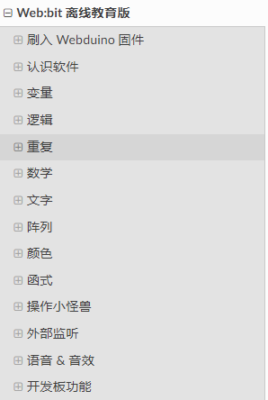
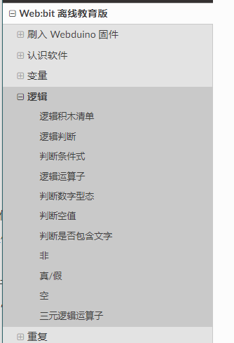
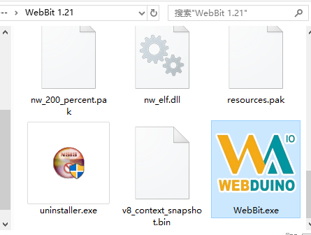

# 制作 Webduino 大陆版任务书

|   修订时间    |                     修订内容                      |
| :-----------: | :-----------------------------------------------: |
| 2019年7月10日 |                  初稿，基本内容                   |
| 2019年7月11日 | 相关材料已经收齐，添加 `任务小组`、`任务具体流程` |
| 2019年7月12日 |            添加物料清单、完善具体流程、多人编辑工具 |
| 2019年7月15日 | 确定 gist 满足需求，可以统一进行文档编辑，只剩准备材料了。  |
| 2019年7月16日 | 准备文档大纲，确定文档范围  |
| 2019年7月17日 | 准备了基本内容任务审核流程，以及常用名词列表登记  |
| 2019年7月24日 | 文档已经初步校正结束，已经得知所有的文档情况  |
| 2019年7月25日 | 开始针对文档进行修改软件和修改文档的工作  |
| 2019年7月29日 | 文档已经修正回简体版内容，开始归档收拾工作，进行部署测试  |
| 2019年8月05日 | 部署测试已经开始，软件已经开始修正，进入软件与文档修订工作  |

## 简繁常用名词翻译表

|   简体    |                     繁体                      | 英文 |
| :-----------: | :-----------------------------------------------: | ------------- |
| 数组 |                   阵列      | array |
| 软件 |                     软体    | software |
| 设备 |                     装置    | device |
| 内置 |                     内建    | build-in |
| 改变 |          增加（变量章节）    |  |
| 序列 |                     数组    | array |
| 回复 |                     恢复    | recovery |
| 储存 |                     保存    | save |
| 开启 |                     打开    | open |
| 存档 |                     文件    | file |
| 项目 |                     变量    |  |
| 變量 |                     变量    | variable |
| 进程代码 |                 代码    | code |
| 输出值 |                 返回值    | return value |
| 数位  |                     数字    | digit |
| 类比  |                     模拟    | analog |
| 脚位 |                     引脚    | IO |
| 簡體 |                     简体    |  |
| 重复 |                     循环    | loop |
| 圖片 |                     图片    | image |
| 網址 |                     网址    | site |
| 度C |                     °C    |  |
| 全彩 LED |                     矩阵 LED    |  |
| 得到 |                     取得    | Get |
| 字元 |                     字符    | char(character) |
| 并非 |                     非    | not |
| 字串 |                     字符串    | string |
| 變數  |                     变量    | variable |
| 错 |                     假    | false |
| 和 |                     且（或 与）    | and |
| 序列埠 |                     串口    | serial |
| 连线 |                     连接    | connect |
| 侦测 |                     检测    | detect |
| 函式 |                     函数    | function |
| 行动 |                     移动    | Move |
| 侦测 |                     检测    | detect |
| 硬体 |                     硬件    | hardware |
| 软体 |                     软件    | software |
| 感测 |                     传感    | sensor |
| 讯号 |                     信号    | signal |
| 迴圈 |                     循环    | loop |
| 支援 |                     支持    | support |
| 採取 |                     采取    | Use |
| 透过 |                     通过    | adopt |
| 扩充 |                     拓展    | expand |

## 目标方向

Webduino 的大陆版的 文档、视频、图片 等内容，受众人群是自己、学生、教师等初学者，做到可以正常复现使用的层次（复杂度单一直接）。

## 项目进度

- [目录大纲](https://demo.codimd.org/Yo4AdMtAQ62DSM4XviQyAg)

- 编辑者应当在编辑之外放下标记，某某校对过等标记。

## 项目流程

文档组工作流程：

- ~~校对本次工作的所有文档。~~

- ~~修订所有文档繁体用词、措辞不当内容。~~

- ~~登记所有文档存在的图片问题，并依次处理。~~

- ~~修改软件内容，配合下一步的文档完全简体中文化工作~~

- 软件修订过程中，需台湾团队配合，确认修订和同步。

- 补充：需 部署文档网站 进行用户体验的模拟，确保大部分符合用户预期。

- 最终文档已经全面简体化，此时开始终审+体验。

- 直至文档全面修订结束，与台湾版保持结构近似即可。

### 2019年8月6日

准备了两个仓库

1. https://github.com/BPI-STEAM/test_webbit

提供 简体版软件 1.2.4 供 简体版文档 体验和测试，供视频拍摄组准备内容。

2. https://github.com/BPI-STEAM/test_docs 

提供内测用的 简体版文档网站，测试部署的文档网站 https://bpi-test-docs.readthedocs.io/zh/latest 。

3. 正在做的事情

基于简体版文档开始体验简体版软件、审核文档让用户可以按步骤正常使用，共 27 篇。

4. 整理的事情有

简、繁、英的翻译对照表，所有文档的归档整理。

5. 未完成的事情

- 未写的文档三篇（语音相关两篇、引脚输入输出一篇）

- 简体版软件 的 安装版和网页版 中的 语言文件 待同步。

- Azure 语音积木的合并，或修改积木外观。

### 2019年7月29日

#### 工作记录

- 文档其中的内容、图片已经处理回简体版，还存在一些细节没有修订，之后将进入文档的整理环节。
- 整理后就当前的文档目录进行网站部署测试，开始进行用户体验测试，此后进入测试环节。

#### 今日总结：

在文档简体化后才能开始真正的审核工作，在这之前的，将会花去 两天（ 3 * 2 * 5 ）的时间进行文档和资源的收拾以及文档部署测试工作。

基于此，对文档的内容进行用户体验测试，以及体验过程中的审核和修订，这将持续一周到两周不等才会逐渐稳定下来。

### 2019年7月25日

#### 工作记录

- 软件已经大量修订，
- 修复完毕以后，开始进行体验测试，此时进入测试环节。

#### 今日总结：

先过一遍内容，形成大纲，再针对每个点进行逐个处理，此时有序不漏任何细节。
最后体验结束后还需要导出文档，进行最终的文档定版。

### 2019年7月24日

#### 工作记录

- 确定了基本的文档情况，收集初步的文档存在的问题，此时将开始修复文档内容。
- 修复完毕以后，开始进行体验测试，此时进入测试环节。

#### 今日总结：

先过一遍内容，形成大纲，再针对每个点进行逐个处理，此时有序不漏任何细节。
最后体验结束后还需要导出文档，进行最终的文档定版。

### 2019年7月21日

#### 工作记录

- 2019年7月18日前的目录进行审核，节假日进行检查，提出自己的想法，周一进行同步。
- 预习 2019年7月21日 确定看过，知道在讲什么就行了。

#### 今日总结：

留空

### 2019年7月19日

#### 工作记录

- 检查处理先前遗留的问题，并且审核 [编辑器介绍（初审，请于明天前过目，再导出存在的问题）] 内容。

#### 今日总结：

- 讨论的结果在思考、同步之后再做修改。
- 文档校对前，先收集所有人的意见到进行审核整合处理。
- 对目录的修订应该是问题记录、讨论、决定解决方案之后再做修改。（谨慎）

### 2019年7月18日

#### 工作记录

- [什么是 Web:Bit 教育版（已审，存在的问题）](https://demo.codimd.org/jJ2G6dd6Sf63MiWBmMIJFw)

- [编辑器介绍（已审）](https://demo.codimd.org/9e-dvxZvRe26RCrmMwV2cw)

#### 今日总结

- 初步反思了一下昨天的情况，补充了教育版主页，需要补充效果图。

> 先随意 try 后发现问题，现在修正项目布局。

重新调整任务流程，先不急着做事，准备团队合作的结构。

进行目标的具体沟通。

- 先定项目大体的目标，再试着沟通到明确范围，再定具体的细节。

- 假定上午 10 点前就先沟通一下今天的工作内容，还有什么问题没解决，下午 5 点后做当天的工作结果审核（文档文件）。

- 假设：前一天应该看一下今天需要审核的文档。

### 2019年7月17日

#### 工作记录

- [开发板介绍（已审，存在的问题）](https://demo.codimd.org/XCESTmS6Tw-nCKtt-IGu1Q)

- ~~初步审核流程（30 份 5 人，预估 6 天完成） 以二级标题（##）为线定义任务，每天上午认领一份文档，预估在下午 4 点的时候进行文档内容审核。~~

- 建立起[目录大纲](https://demo.codimd.org/Yo4AdMtAQ62DSM4XviQyAg)

#### 今日总结

建立了目录结构，试图处理了第一个 **开发板介绍** 文档，过了一遍全局内容。

## 任务内容

1. 核对板子通用介绍部分的文档，共两篇。
2. 将机翻过的简体 markdown 文档仔细校对和审核，确保大陆版能正常使用，包括图片简体内容等。
3. 使用 `WebBi Setup_1.2.1` 的离线版软件进行各项功能测试，将存在的问题实时反馈给台湾开发团队。
4. 软件使用 Webduino 固件的各项测试和包装发布，目前暂定为重新打包 20190604 的固件版本。
5. 制作修正硬件不同版本的文档以及表格数据，如 1.2 、 1.4 的硬件描述，目前还未仔细审核硬件的各项介绍。
6. 根据软件使用情况编排内容，进行视频的设计和拍摄。

如有遗漏可以补充。

额外任务：*替换大陆不可用的同类积木，如语音、微信、机器人（包含各类查询服务）的积木，目前微信还在开发中。*

## 准备工作

1. 准备烧录工具、安装程序、文档链接，确保每个人都可以开箱使用，已存放U盘。
2. 相关 markdown 文档源码一份，并基于此开始整体的修正工作。
3. 一台全新的 Windows7  32 位家庭简易版 做标准测试机，再加一台 Windows 10 64 位系统。
4. 确保每个文档都有标注这类内容：软件版本、固件版本、文档版本。
5. 准备拍摄视频的器材，较为专业和正式一些。
6. 离线软件准备一个 Github 仓库（https://github.com/BPI-STEAM/test_repository），用于同步软件体验组的修改记录。
7. 目前文档移交到 https://demo.codimd.org  网站进行多人协助编辑文档，仓库只做备份。

如有遗漏可以补充。

## 物料清单

| 物料清单                               | 数量 | 备注                     |
| -------------------------------------- | ---- | ------------------------ |
| 硬件驱动、硬件固件、烧录软件、测试软件 | *1   | Github 仓库全打包完毕    |
| 教育版 & 开发版 文档                   | *40  | markdown 文档            |
| 人                                     | *7   |                          |
| 同步文件仓库（或可选其他工具           | *1   | 备选 gitbook 但登录不上  |
| Windows 测试环境                       | *2   | win7 32 位 & win10 64 位 |
| 补光灯、录音卡                         | *2   | 各一个                  |
| 桌子与凳子                             |      | 两桌4座                         |

## 人员情况

TIM 老师、陈俊欢、陈渊、刘煜标、王皓、瞿少敏、光发。

### 任务小组（人员可能混合，主要是划分职责）

文档修订组

- 职责范围：翻译文档，修订文档，统计文档。

视频拍摄组

- 职责范围：准备素材，制作剧本。

软件体验组

- 职责范围：根据文档配合翻译改软，阅读以及使用文档，配合测试软硬件。

## 任务分配（初步

1. 修正预处理的简体文档分软件和硬件使用基础两个阶段，总量为 40 份，包含教育版和~~开发版~~的文档。
2. 针对文档修正后的软件测试体验工作，确保小白在使用过程中没有任何问题和阻碍。
3. 针对通常的软件使用体验进行某类视频拍摄的文案和脚本设计做编排。

如有遗漏可以补充。

### 任务具体流程（20190716起）

分发所有相关的软件、工具、资料、硬件等基础设施，确保有需要的人都有一个基本的套件。（准备工作）

#### 文档组

1. 先是修订文档目录（ 1 - 2 天）

   - 所有文档的总体情况，如下截图。

   - 

   - 对以上目录提出建议与修订后，开始划分文档修订人员工作范围（认识、基础、应用等）分类内容。

2. 再根据修订的文档后划分工作量（40 天 / 修订文档人员）

   - 对具体文档的内容进行整理，例如某类文档的内部细节。

   - 

   - 务必在文档开头标注：使用硬件版本、固件版本、软件版本、系统版本、修订时间。

~~文档要求任何一人，对于期望修订的前一天（以 20190715 开始着手准备）对某篇内容进行 **原版打印** 转交给各位需要查阅的人，并在文档开头标注：使用硬件版本、固件版本、软件版本、系统版本、修订时间。~~

#### 软件组

1. 测评体验软件

   - 获取 https://github.com/BPI-STEAM/test_repository 仓库直接运行`\WebBit 1.21\WebBit.exe` 即可启动软件。

   - 

2. 修改软件内容

   - 在仓库建议使用 VS CODE 查找软件内部文字变量直接对内部进行内容修正与查看效果
   - 使用 Git-hub 仓库能确保所有人在使用软件的时候都能同步到最新的一份，届时修正完毕后也将此代码交给台湾对方比对仓库并合并。

   - 结合文档去体验和使用软硬件，使用过程中可以将反馈和建议提供给文档组，务必确保任何人使用都不会出现困难和错误。

#### 视频组

1. 准备材料
   - 配合其他两个小组准备素材、内容、相关软硬件器件。（文档工作前一周进行协助工作
2. 制作视频
   - 配合文档与软件，策划内容，具体如何制作（文档工作开始一周后再议。
3. 设计内容
   - 结合用户群体考虑，综合考虑宣传、文档、使用、以及缺失内容的补充。

#### 开发 & 维修组（隐藏

如果途中遇到什么软件、硬件工具缺失，务必加急处理修复。

注意，各个小组需要什么帮助也请提出。

## 任务时间

20190716 起预计一个月后，即为 20190816 左右结束。

## 交付内容

- 在大陆可用的简体文档，文档链接。
- 大陆版软件的简体变量，合并打包。
- 在大陆版可用的相同功能拓展积木。
- 大陆版软件文档与对应的视频教程。
