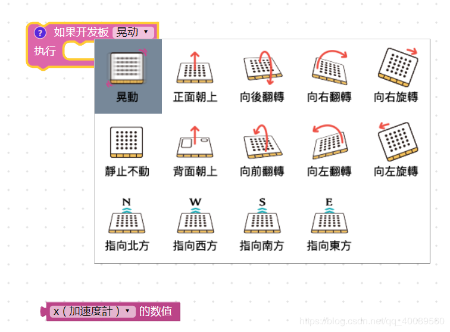
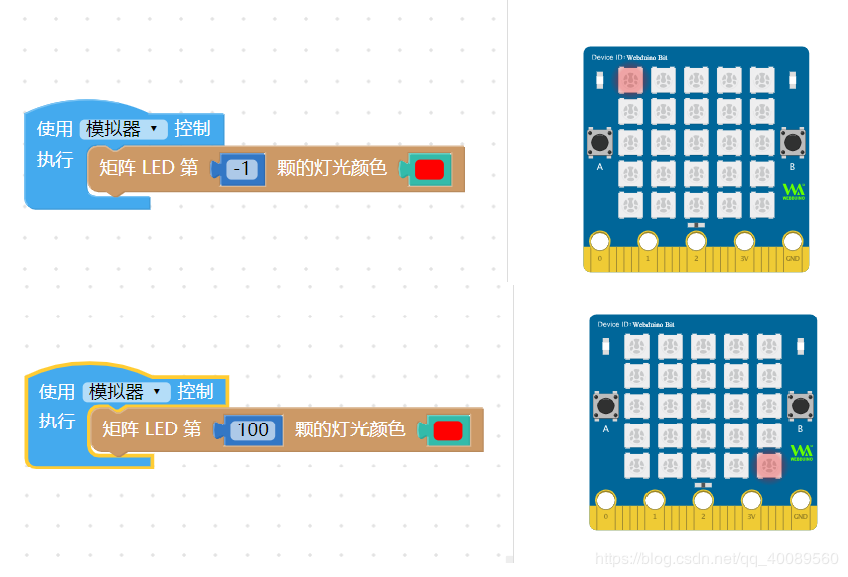
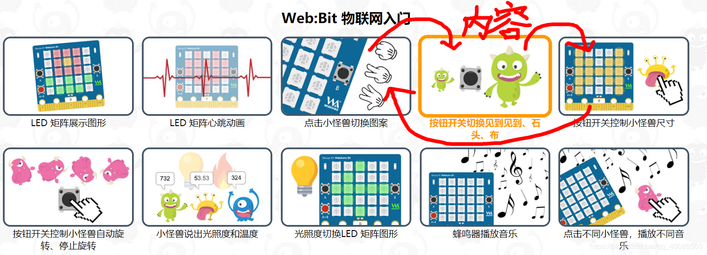
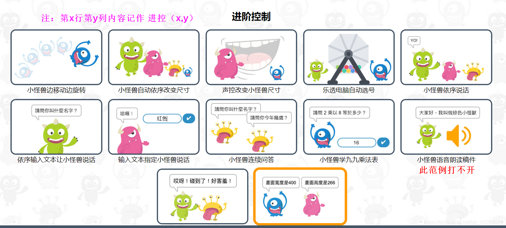
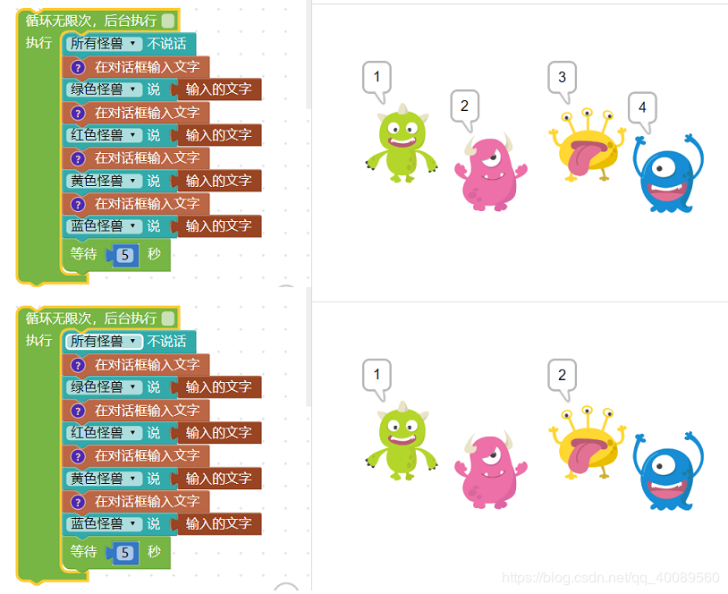
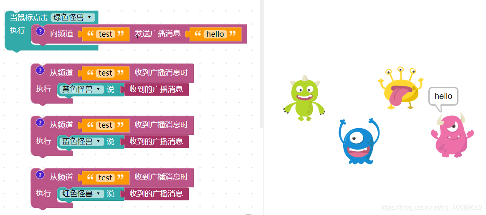

## WebBit大陆版测试报告

- | 测试日期      | 测试环境          | 硬件版本  | 固件版本           | 软件版本 | 测试人员      |
  | ------------- | ----------------- | --------- | ------------------ | -------- | ------------- |
  | 2019年8月22日~27日 | Windwos10 & browser |  1.4 | 7NJfWecLminDsnEtpD | 1.2.5   | 陈渊 |

## 1、测试目的：
- 提供 如何让一般家用机用户获取与安装 Web:BIt 软件 说明书（build）。
- 提供 如何让用户在空白干净的电脑下，学习使用软件的 说明书（docs）。

## 2、测试环境
硬件环境：  BIT板的1.4版本
软件环境： Windows 10家庭版  WebBit软件

## 3、测试方法
使用以用户文档为基础构造的测试用例来测试WebBit软件和硬件。
测试使用的 [用户文档](https://bpi-steam-docs.readthedocs.io/zh_CN/latest/webduino/tutorials/index.html)
## 4、测试内容

- | 测试日期      | 测试环境          | 硬件版本  | 固件版本           | 软件版本 | 测试人员      |
  | ------------- | ----------------- | --------- | ------------------ | -------- | ------------- |
  | 2019年8月22日~24日 | Windwos10 & browser |  1.4 | 7NJfWecLminDsnEtpD | 1.2.5   | 陈渊 |

积木编程基础

    1. 变量
    2. 逻辑
    3. 循环
    4. 文字
    5. 数组
    6. 颜色
    7. 函数
    8. 数学

小怪兽互动

    1. 小怪兽基本操作
    2. 小怪兽互动＆舞台

系统功能

    1. 键盘行为
    2. 日期＆时间
    3. 对话框输入文字

音效 & 语音

    1. 特殊音效

开发板功能

    1. 开发板
    2. 矩阵 LED
    3. 按钮开关
    4. 光线＆温度
    5. 音乐＆声音
    6. 运动 & 姿态
    7. 输入 & 输出

网络功能

    1. 网络广播
    
软件界面菜单功能   

      1. 范例  
      2. 测试有线与无线连接
## 5、测试结果
- | 测试日期      | 测试环境          | 硬件版本  | 固件版本           | 软件版本 | 测试人员      |
  | ------------- | ----------------- | --------- | ------------------ | -------- | ------------- |
  | 2019年8月22日 | Windwos10 & browser |  1.4 | 7NJfWecLminDsnEtpD | 1.2.5   | 陈渊 |
积木编程基础  

    1. 变量   通过
    2. 逻辑   通过
    3. 循环   通过
    4. 文字   通过
    5. 数组   通过
    6. 颜色   通过
    7. 函数   通过
    8. 数学   通过

小怪兽互动

    1. 小怪兽基本操作  通过
    2. 小怪兽互动＆舞台  通过

系统功能

    1. 键盘行为   通过
    2. 日期＆时间   通过
    3. 对话框输入文字  小问题：文字输入框的勾号存在bug

音效 & 语音

    1. 特殊音效  通过
   
开发板功能

    1. 开发板  通过
    2. 矩阵 LED  通过
    3. 按钮开关  通过
    4. 光线＆温度  通过
    5. 音乐＆声音    有小问题（【停止演奏】积木需要内置部分延时）
    6. 运动 & 姿态  通过
    7. 输入 & 输出  通过
 
网络功能

    1. 网络广播  未通过（模拟器上面无法模拟）

## 6、问题总结

 1. WebBit大陆版软件仍有部分积木展开后的字体为繁体。 如下图： 

 2. 矩阵LED的灯号边界问题 ：可以点亮小于1大于25的灯号

 2. 范例【物联网入门】里面有三个视频内容顺序排错    物联网入门（1，3） （1，4） （1，5）里面的积木内容 放错位置 为（1，4） （1，5） （1，3）    

 3. 范例里面的部分模块  还是繁体，如：变数应该为“变量” 、静音的‘静’字、加速度计的‘计’字
 4. 范例里面的部分内容仍然是繁体，坐标记录如下（行，列）：基操（2，3）、（2，5）  进控（1，2） （1，4） （2，2） （2，3）（2，4） （3，1）（3，2）（ 2，5）不能打开  

 5. 输入文本框的勾号问题，通过点击勾号输入多个内容时会导致间隔输入空白

 6. 使用USB连接板子时 ，执行无限循环点灯时，如果灯的最后状态是亮着的，通过软件的”停止“按钮，并不能真正的使板子实体的灯熄灭。
 7. 我测试的板子有部分硬件延迟响应。
 8. 网络广播在软件上面模拟时，如下：只有最后一个小怪能够接受到广播信息。
 
 

## 7、建议

 1. 矩阵LED设置灯号边界，可操作的灯号范围【1~25】。
 2.  教育版  音乐&音效 里面 【停止演奏】积木需要内置部分延时。
 3. 对于WebBit大陆版软件的范例，及时把繁体示例更改为简体示例，把“变量”积木  和“静音”积木改为简体中文。
 4. 范例【物联网入门】里面有三个视频顺序排错的内容需调整过来。
 5.  若遇到部分硬件响应延时的问题，建议检查连接方式；如果是无线连接的话，可调整BIT板子的位置，使其wifi信号增强；如果是USB连接方式，可检查固件更新或重新连接板子。
 6. 针对问题6，可以尝试按多次“执行” “停止”，即可使板子的灯停止下来。
 7. 部分引脚图：如在输入输出部分的引脚图，可在图片前后附上英文缩写的解释或名词解释链接。
 8. WebBit软件上模拟广播时，最后一个【接收信息】积木会占用频道。

## 8、报告总结
软件界面功能可用，webBit教育版文档内容可正常使用，部分积木逻辑上存在细节缺陷。
在不考虑板子本身问题，有线和无线两种环境下硬件功能均正常通过。

## 9、附件

[WebBit软件安装说明书  ](https://blog.csdn.net/qq_40089560/article/details/100003033)

[WebBit软件引导使用说明书 ](https://blog.csdn.net/qq_40089560/article/details/100074418)

